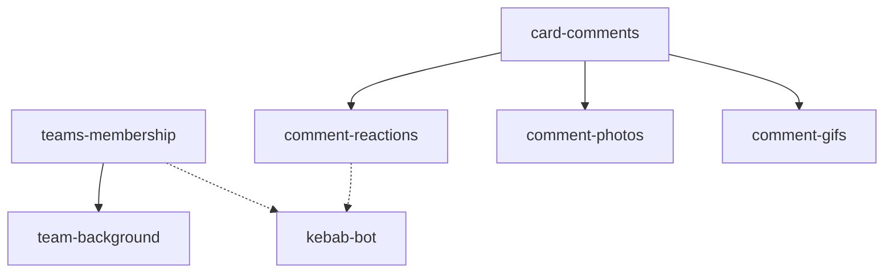

# Backlog — Scrum Retro App

Kolejność sugerowana według zależności technicznych. Pozycje wyżej blokują lub ułatwiają te niżej.

| Priorytet | ID | Funkcja | Status |
|-----------|-----|---------|--------|
| P0 | `teams-membership` | Zespoły i przydzielanie użytkowników | pending |
| P1 | `team-background` | Tło tablicy retro (per zespół) | pending |
| P1 | `card-comments` | Komentarze pod kartami | pending |
| P2 | `comment-reactions` | Reakcje emoji na komentarzach | pending |
| P2 | `comment-photos` | Zdjęcia w komentarzach | pending |
| P2 | `comment-gifs` | GIFy w komentarzach | pending |
| P3 | `kebab-bot` | KebabBot (easter egg) | pending |

---

## 1. Zespoły i przydzielanie użytkowników

**ID:** `teams-membership`  
**Priorytet:** P0 — fundament pod tło zespołowe i przyszłe uprawnienia

### Cel

Użytkownicy należą do zespołów. Tablice retro mogą być powiązane z zespołem. Admin zarządza członkostwem.

### Model danych (propozycja)

```
retro_teams
  id, name, slug, created_at

retro_team_members
  team_id FK, user_id FK, role (member|lead), joined_at
  UNIQUE(team_id, user_id)
```

Opcjonalnie na później: `retro_boards.team_id` — tablica należy do zespołu.

### Seed (pierwsza iteracja)

- Utworzyć zespół **IT10** (`slug: it10`)
- Przypisać istniejącego admina z seeda (`SEED_ADMIN_EMAIL`, domyślnie `tomasz.madera@wskz.pl`) do IT10 z rolą `lead`
- Seed idempotentny — jak `seedAdmin()`, nie duplikować przy ponownym uruchomieniu

### UI / API

- Panel admina: lista zespołów, dodawanie użytkownika do zespołu, usuwanie
- Użytkownik widzi „swój” zespół na dashboardzie (opcjonalnie w v1)

### Kryteria akceptacji

- [ ] Migracja + tabele `retro_teams`, `retro_team_members`
- [ ] Rozszerzony `pnpm db:seed` — zespół IT10 + admin jako lead
- [ ] Admin może przypisać użytkownika do zespołu
- [ ] Testy: seed idempotentny, przypisanie członka

---

## 2. Wgrywanie tła tablicy retro (per zespół)

**ID:** `team-background`  
**Priorytet:** P1  
**Zależność:** `teams-membership`

### Cel

Admin zespołu wgrywa obraz tła wyświetlany na tablicy retro całego zespołu. W metadanych zapisujemy, który admin (i z którego zespołu) wgrał plik.

### Model danych (propozycja)

```
retro_team_backgrounds
  id
  team_id FK
  uploaded_by FK → retro_users (admin zespołu)
  storage_key / url
  original_filename
  mime_type
  created_at
  is_active (boolean — jedno aktywne tło na zespół)
```

### Przechowywanie plików

- Dev: katalog `uploads/team-backgrounds/` (gitignored) lub volume Docker
- Prod: S3-kompatybilne storage albo katalog na serwerze za reverse proxy
- Walidacja: max rozmiar (np. 2 MB), dozwolone MIME (`image/jpeg`, `image/png`, `image/webp`)
- Generowanie miniatury / optymalizacja opcjonalnie w v2

### UI

- Ustawienia zespołu (admin): upload, podgląd, „usuń / przywróć domyślne”
- Tablica retro: `background-image` na shellu tablicy, z zachowaniem czytelności kart (overlay / przyciemnienie)

### Kryteria akceptacji

- [ ] Tylko admin (lub lead zespołu) może wgrać tło
- [ ] Tło widoczne na tablicach zespołu
- [ ] W UI widać kto i kiedy wgrał („Wgrane przez …”)
- [ ] Usunięcie tła przywraca domyślny motyw

---

## 3. Komentarze pod kartami

**ID:** `card-comments`  
**Priorytet:** P1  
**Zależność:** brak (ale wymagane przed reakcjami, zdjęciami i GIFami)

### Cel

Wątek dyskusji pod każdą kartą kanban — tekst, autor, timestamp.

### Model danych (propozycja)

```
retro_card_comments
  id
  card_id FK
  author_id FK
  content text (markdown lub plain)
  created_at
  updated_at
```

### UI

- Rozwijany panel komentarzy na karcie
- Formularz dodawania (tylko na aktywnej tablicy)
- Licznik komentarzy na karcie

### Kryteria akceptacji

- [ ] Dodawanie / listowanie komentarzy
- [ ] Autor i data przy każdym komentarzu
- [ ] Zamknięta tablica — tylko odczyt

---

## 4. Reakcje emoji na komentarzach

**ID:** `comment-reactions`  
**Priorytet:** P2  
**Zależność:** `card-comments`

### Cel

Szybkie reakcje na komentarz — jeden użytkownik może dać wiele różnych emoji, ale tylko jedną instancję danego typu (toggle).

### Dozwolone emoji

| Emoji | Uwagi |
|-------|--------|
| 👍 | thumbs up |
| 🙂 | uśmiech |
| 😄 | śmiech |
| ❤️ | serce |
| 🍕 | pizza |
| 📻 | radio / retro vibe |
| 🥒 | ogórek |
| 😭 | łzy |
| 😢 | smutek |
| 🥩 | mięso / kebab lore |

Stała lista w kodzie (`REACTION_EMOJIS`) — bez dowolnych emoji z klawiatury (prostsza walidacja, spójny UI).

### Model danych

```
retro_comment_reactions
  comment_id FK
  user_id FK
  emoji varchar(10)  -- kod Unicode
  created_at
  UNIQUE(comment_id, user_id, emoji)
```

### UI

- Pasek reakcji pod komentarzem
- Kliknięcie = toggle
- Agregacja: `🍕 3` z podpowiedzią kto zareagował (tooltip)

### Kryteria akceptacji

- [ ] Tylko emoji z whitelisty
- [ ] Toggle reakcji w czasie rzeczywistym (optimistic UI)
- [ ] Testy walidacji emoji

---

## 5. Zdjęcia w komentarzach

**ID:** `comment-photos`  
**Priorytet:** P2  
**Zależność:** `card-comments`

### Cel

Użytkownik dołącza zdjęcie do komentarza (np. screenshot, zdjęcie z retro).

### Model danych

```
retro_comment_attachments
  id
  comment_id FK
  type enum('image')
  storage_key / url
  mime_type
  width, height (opcjonalnie)
  created_at
```

Komentarz może mieć tekst + załącznik lub sam załącznik.

### Ograniczenia

- Max 1–3 zdjęcia na komentarz (do ustalenia)
- Max rozmiar pliku (np. 5 MB)
- Dozwolone: JPEG, PNG, WebP
- Sanityzacja nazw plików, skan antywirusowy — opcjonalnie prod

### UI

- Przycisk „Dodaj zdjęcie” przy formularzu komentarza
- Miniatura w wątku, lightbox po kliknięciu

### Kryteria akceptacji

- [ ] Upload + wyświetlanie miniatury
- [ ] Błędy walidacji po stronie serwera
- [ ] Usunięcie komentarza usuwa pliki (cascade / cleanup job)

---

## 6. GIFy w komentarzach

**ID:** `comment-gifs`  
**Priorytet:** P2  
**Zależność:** `card-comments`

### Cel

Wstawianie animowanych GIFów do komentarzy przez wyszukiwarkę zewnętrznego katalogu.

### Integracja (propozycja)

| Provider | Plusy | Minusy |
|----------|-------|--------|
| **Tenor** (Google) | Darmowy tier, dobre API | Wymaga klucza API |
| **Giphy** | Popularny katalog | Limity rate, klucz API |

Rekomendacja na start: **Tenor API v2** — endpoint search + embed URL (nie hostujemy GIFów sami).

### Model danych

```
retro_comment_attachments.type = 'gif'
  external_url   -- URL z Tenor/Giphy
  preview_url    -- statyczny preview
  provider       -- 'tenor' | 'giphy'
  provider_id    -- ID w katalogu
```

Alternatywa: traktować GIF jak `image` z flagą `animated: true`.

### UI

- Przycisk „GIF” obok pola komentarza
- Modal z wyszukiwarką (debounce 300 ms)
- Podgląd przed wysłaniem
- Lazy-load / `loading="lazy"` — oszczędność transferu

### Env

```
TENOR_API_KEY=...
# lub GIPHY_API_KEY=...
```

### Kryteria akceptacji

- [ ] Wyszukiwanie i wstawianie GIFa bez uploadu na nasz serwer
- [ ] Attribution zgodnie z ToS providera (logo „Powered by Tenor”)
- [ ] Fallback gdy brak klucza API — przycisk ukryty lub komunikat

---

## 7. KebabBot — easter egg „AI do zamawiania kebaba”

**ID:** `kebab-bot`  
**Priorytet:** P3 (fun, nie produkcyjna funkcja)  
**Zależność:** opcjonalnie `teams-membership` (żarty per zespół)

### Cel

Zabawna funkcja-satyna: **nie zamawia prawdziwego kebaba**. Symuluje „inteligentne” zamówienie w stylu retro terminala — idealny easter egg na koniec sprintu.

### Koncepcja UX

1. W menu tablicy (lub po kliknięciu 🍕/🥩 przy karcie) pojawia się **„Zamów kebaba”**
2. Otwiera się modal / panel w stylu CRT z fałszywym „AI Assistant: KebabBot v0.1”
3. Bot zadaje absurdalne pytania:
   - „Jaki poziom ostrości: łagodny / średni / „chcę zobaczyć Boga”?“
   - „Falafel czy mięso? (odpowiedź zawsze ignorowana)”
   - „Czy dodajesz 🥒? (zalecane przez zespół IT10)”
4. Po „analizie” (progress bar 3–5 s) generuje **fikcyjne zamówienie**:

```
╔══════════════════════════════════════╗
║  KEBAB ORDER #0042 — STATUS: FAKE    ║
║  ────────────────────────────────────  ║
║  > 1x Mega Durum (extra 📻 vibes)    ║
║  > sos: tajemniczy                      ║
║  > ETA: nigdy (to tylko retro)          ║
║  > płatność: 1x 🍕 reakcja             ║
╚══════════════════════════════════════╝
```

5. Przycisk **„Wyślij na #random”** kopiuje ASCII art do schowka
6. Opcjonalnie: wpis w logu aktywności tablicy („Tomek uruchomił KebabBot”)

### Implementacja (minimalna)

- **Bez** prawdziwego API restauracji, płatności ani danych osobowych
- Logika po stronie klienta + ewentualnie prosty server action zwracający losowy „order template”
- Szablony odpowiedzi w pliku JSON (10–15 wariantów)
- Powiązanie z emoji 🍕 🥩 🥒 z reakcji — opcjonalny Easter egg copy

### Kryteria akceptacji

- [ ] Jasny disclaimer: „To żart — nic nie zostało zamówione”
- [ ] Działa offline / bez kluczy zewnętrznych
- [ ] Nie wymaga uprawnień admina — każdy na tablicy może uruchomić
- [ ] Styl spójny z motywem CRT

---

## Zależności między zadaniami



---

## Notatki techniczne

- Wszystkie nowe tabele: prefiks `retro_`
- Uploady: wspólny moduł `lib/storage/` dla tła zespołu i zdjęć w komentarzach
- Komentarze + reakcje: rozważyć Server Actions + revalidatePath na tablicy
- KebabBot: zero kosztów API, czysty fun — można wdrożyć niezależnie od reszty
