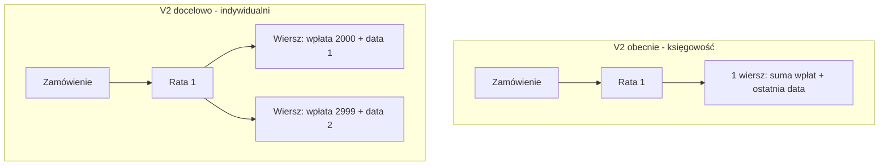

# Raport wpłat V2 – rozbicie wpłat na osobne wiersze (indywidualni)

## Oryginalne zlecenie

> Aby raport zwracał każdą wpłatę niezależnie czy ktoś zapłacił część czy całość raty. Przykład: aktualnie w raporcie mamy tylko jeden wiersz z wpłatą 4999 i z ostatnią datą. Chodzi o to, aby w przypadku kilku wpłat były wyszczególnione tak jak jest w adminie. Jeżeli ktoś zapłaci część raty i po jakimś czasie kolejną wpłatę zrobi, to pole „wysokość wpłaty" nadpisuje się i wyświetla się suma tych dwóch wpłat oraz wyświetla się w polu „data zapłaty raty" data ostatniej wpłaty — a tu potrzebowalibyśmy dostęp do wszystkich wpłat. W sytuacji kiedy jedna osoba zapłaci jakąś część raty dwa razy musiałyby być dwa niezależne wiersze.

Zakres potwierdzony: **tylko raport indywidualny**. Bezrobotni i firmy bez zmian.

---

## Problem

Obecny [`PaymentReport/StudiaOnlineV2Individual`](public/_class/Reports/PaymentReport/StudiaOnlineV2Individual.php) to pusty subclass księgowości. W [`AccountingReport/StudiaOnlineV2Individual`](public/_class/Reports/AccountingReport/StudiaOnlineV2Individual.php) pętla `foreach ($dues as $due)` zapisuje **1 wiersz na ratę**:

```271:281:public/_class/Reports/AccountingReport/StudiaOnlineV2Individual.php
if ($due['amount_schedule'] > 0) {
    $data['wysokosc_raty'] = number_format($due['amount'] + $due['amount_schedule'], 2, '.', '');
    $data['wysokosc_wplaty'] = number_format($due['amount_schedule'], 2, '.', '');
} else {
    $data['wysokosc_raty'] = number_format($due['amount'], 2, '.', '');
    $data['wysokosc_wplaty'] = number_format($due['paid'] ? $due['amount'] : 0, 2, '.', '');
}
$data['data_zaplaty_raty'] = $due['payment_date'];
```

To agreguje częściowe wpłaty w jednym polu (`amount_schedule` / `payment_date` z `student_payment_schedule`).

## Wzorzec do wykorzystania

Raport wpłat V1 ([`PaymentReport/StudiaOnlineV2`](public/_class/Reports/PaymentReport/StudiaOnlineV2.php)) już rozwiązuje ten problem w `generateRow()`:
- P24 – osobny wiersz per transakcja online
- DOK – osobne wiersze z `student_payment_schedule_log_items` (wpłaty admina)
- Generator `yield` zwraca wiele wierszy na jedną ratę



## Strategia implementacji

Połączyć **kontekst zamówienia z księgowości V2** z **logiką rozbicia wpłat z V1**:

1. Zachować budowanie danych zamówienia z `StudiaOnlineV2Individual` (OrdersRepository, DuesRepository, kolumny accounting, promocje, anulowania itd.)
2. Zamiast `writeRow($data)` raz per rata – wywołać expander wpłat, który zwraca N wierszy per rata
3. Wyekstrahować logikę rozbicia z V1 do traitu, żeby nie duplikować ~200 linii SQL/cache

### Nowy trait: `InstallmentPaymentExpander`

Plik: [`public/_class/Reports/PaymentReport/InstallmentPaymentExpander.php`](public/_class/Reports/PaymentReport/InstallmentPaymentExpander.php)

Przenieść z V1 (bez zmiany logiki biznesowej):
- `expandInstallmentPayments(array $installment, array $rowBase, int $orderId): \Generator`
- `getDokPayments`, `getOnlinePayment`, `getOnlinePaymentForFirstInstallment`
- `isFirstInstallmentOfTheCurrentOnlineTransaction`, `getPaidInstallmentsSumExceptCurrentOne`
- `subtractAmountBySpecialisationPaymentAmount`, `getSpecialisationInstallmentLogs`
- powiązane cache (`dokPaymentsCache`, `onlinePaymentCache`, itd.)

Trait operuje na strukturze raty wymaganej przez expander (`sps_id`, `study_student_id`, `installment_number`, `amount`, `amount_schedule`, `paid`, `zamowienie_id`) – pola dostępne w `DuesRepository::getDuesForOrders()`.

### Zmiana generatora indywidualnego

Plik: [`public/_class/Reports/PaymentReport/StudiaOnlineV2Individual.php`](public/_class/Reports/PaymentReport/StudiaOnlineV2Individual.php)

- `use InstallmentPaymentExpander`
- Nadpisać `writeRows()` – skopiować logikę z accounting, ale w pętli `foreach ($dues as $due)`:
  1. Zbudować `$data` per rata (jak teraz w accounting)
  2. Zmapować `$due` → `$installment` dla traitu
  3. `foreach ($this->expandInstallmentPayments(...) as $paymentRow)` → `writeRow(array_merge($data, $paymentRow))`
  4. Jeśli brak wpłat (rata nieopłacona) – opcjonalnie zapisać 1 wiersz z `wysokosc_wplaty = 0` (zachowanie jak V1: ostatni `yield` z `amountNeededToBeBooked`)

### `fractional_order`

Accounting ustawia `fractional_order = 1 / count($dues)` per wiersz raty. Po rozbiciu wpłat:
- policzyć łączną liczbę wierszy wyjściowych per zamówienie (po expandzie)
- ustawić `fractional_order = 1 / totalRows` na każdym wierszu

### Bez zmian

- [`StudiaOnlineV2Unemployed`](public/_class/Reports/PaymentReport/StudiaOnlineV2Unemployed.php) – model dotacji, 1 wiersz/zamówienie
- [`StudiaOnlineV2Company`](public/_class/Reports/PaymentReport/StudiaOnlineV2Company.php) – model firm, bulk insert
- Tabele `payment_reports_v2`, crony, komendy
- Raport wpłat V1 (`individual_payment_reports`)

### Refaktor V1 (opcjonalny, minimalny)

[`PaymentReport/StudiaOnlineV2`](public/_class/Reports/PaymentReport/StudiaOnlineV2.php) może użyć tego samego traitu w `generateRow()` zamiast własnych metod – redukuje duplikację, ale nie jest wymagany do spełnienia zlecenia. Zrobić tylko jeśli diff pozostanie czytelny.

---

## Weryfikacja

1. Zapisać oryginalne zlecenie w [`tasks/todo.md`](tasks/todo.md) (sekcja nowego zadania)
2. Wygenerować raport V2 indywidualny na znanym zamówieniu z częściowymi wpłatami DOK/P24
3. Porównać liczbę wierszy i kwoty z:
   - panelem admina (`student_payment_schedule_log`)
   - raportem V1: `reports:individual_order_payment_report:studia_online_v2:generate`
4. Sprawdzić, że kolumny spoza wpłaty (dane zamówienia, rabaty, anulowania) są identyczne między wierszami tej samej raty
5. `php -l` + uruchomienie komendy `reports:payment_report:studia_online_v2_individual:generate`

## Ryzyka

- **Specjalizacje** – V1 ma logikę `subtractAmountBySpecialisationPaymentAmount`; trait musi ją przenieść 1:1
- **Wpłaty zbiorcze P24 (saldo)** – V1 rozróżnia `isFirstInstallmentOfTheCurrentOnlineTransaction`; bez tego błędne kwoty
- **Wydajność** – expander robi dodatkowe zapytania per rata; cache z V1 to łagodzi; monitorować na pełnym zakresie dat
